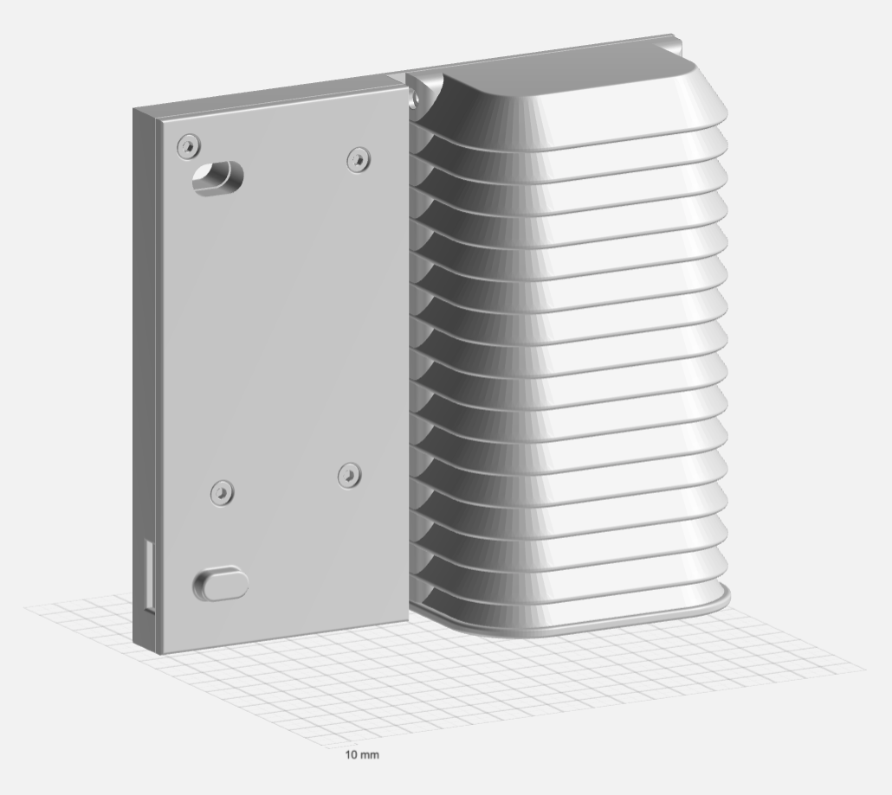

# MASK (Mints Automobile Sensing Kit)

The MASK is a compact sensing system designed for installation on a vehicle’s rear license plate. It collects real-time data on particulate matter (PM), carbon dioxide (CO₂) levels, temperature, humidity, and atmospheric pressure.

